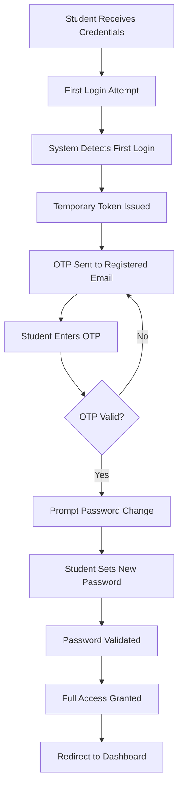

# BRICKS Dashboard

<div align="center">

**A Secure Internal Learning Management System**

*Connecting Students, Teachers, and Administrators in the BRICKS Education Ecosystem*

[](https://opensource.org/licenses/MIT)
[](https://nodejs.org/)
[](https://www.mongodb.com/)

</div>

---

## 📋 Table of Contents

- [Overview](#-overview)
- [Why BRICKS is Different](#-why-bricks-is-different)
- [Key Features](#-key-features)
- [User Journey](#-user-journey)
- [Security Architecture](#-security-architecture)
- [Tech Stack](#-tech-stack)
- [Installation](#-installation)
- [API Documentation](#-api-documentation)
- [Environment Variables](#-environment-variables)
- [Development & Testing](#-development--testing)
- [Roadmap](#-roadmap)
- [Contributing](#-contributing)

---

## 🎯 Overview

The **BRICKS Dashboard** is a purpose-built, secure internal platform designed exclusively for the BRICKS education ecosystem. It serves as a centralized hub where teachers can create and manage classes, students can access learning materials and attend live sessions, and administrators can oversee the entire educational infrastructure.

Unlike public learning platforms, BRICKS Dashboard operates as a **closed system** — ensuring that only verified institutional members can access the platform, maintaining data integrity and educational quality.

---

## Why BRICKS is Different

### **No Public Registration — By Design**

BRICKS Dashboard intentionally **does not have a public registration route** in production. Here's why:

#### **1. Controlled Access Environment**
- Only verified students and teachers from BRICKS partner institutions can access the system
- Each user is mapped to specific batches, schools, and cohorts
- No anonymous or unverified users can enter the ecosystem

#### **2. Data Integrity & Security**
- **100% authentic user base** — no fake accounts or spam
- Accurate student-teacher-batch relationships maintained from day one
- Reduced security vulnerabilities from public-facing registration endpoints

#### **3. Institutional Accountability**
- User accounts are created during official onboarding processes
- Schools and institutions maintain responsibility for their user lists
- Administrators have full visibility into who accesses the system

#### **4. Seamless Integration**
- User data is imported directly from verified school databases
- Pre-configured batch assignments and role-based permissions
- Students and teachers start with proper context from login one

> **In Production**: User accounts (students, teachers, admins) are created by the BRICKS team during institutional onboarding. Each account is verified, mapped to specific batches/schools, and assigned appropriate roles before credentials are shared.

---

## ✨ Key Features

### **For Students**
- 📚 **Class Discovery** — View upcoming classes with pre-read materials
- 🔔 **Smart Notifications** — Get reminders before class starts
- 🎥 **Live Class Access** — Join sessions directly from the dashboard
- 📊 **Progress Tracking** — Monitor your learning journey and completion rates
- 📝 **Resource Library** — Access all course materials in one place

### **For Teachers**
- ✏️ **Class Creation** — Post and schedule classes with ease
- 📎 **Material Upload** — Attach pre-reads, slides, and resources
- 👥 **Student Management** — View enrolled students per batch
- 📈 **Analytics** — Track attendance and engagement metrics
- 🔗 **Meeting Integration** — Add Zoom/Meet links for live sessions
- **Assignments Posting** - Add batch specific assignments

---

## 🚀 User Journey

### **First-Time Student Login Flow**

When a student logs in for the first time, BRICKS implements a secure, guided onboarding process:



#### **Step-by-Step Breakdown**

1. **Initial Login**
   - Student uses temporary credentials provided by BRICKS team
   - System identifies this as a first-time login

2. **Identity Verification**
   - A secure OTP is sent to the student's registered email
   - This confirms account ownership and email validity

3. **Password Setup**
   - Student creates a strong, personalized password
   - Old temporary credentials are invalidated

4. **Dashboard Access**
   - After successful setup, student gains full access to classes and materials
   - Subsequent logins use the new password with JWT authentication

#### **Why This Flow?**

- **Security First**: OTP verification prevents unauthorized access
- **User Ownership**: Students control their own passwords from the start
- **Seamless Onboarding**: Simple 3-step process gets students up and running quickly
- **Email Validation**: Confirms communication channel for future notifications

---

### **Teacher Workflow**

Teachers have a straightforward experience focused on content delivery:

1. **Login** → Authenticate with credentials
2. **Dashboard** → View scheduled classes and student batches
3. **Create Class** → Add new session with title, description, date/time
4. **Upload Materials** → Attach pre-reads and resources
5. **Share Link** → Add Zoom/Meet URL for live session
6. **Publish** → Students immediately see the new class
7. **Track** → Monitor attendance and engagement

---

## 🔒 Security Architecture

### **Authentication Flow**

```
┌─────────────┐
│   Client    │
└──────┬──────┘
       │ 1. Login Request (email + password)
       ▼
┌─────────────────────────────────────┐
│         Backend API                 │
│  • Validate credentials             │
│  • Check first login status         │
│  • Generate JWT or Temp Token       │
└──────┬──────────────────────────────┘
       │ 2. Token Response
       ▼
┌─────────────┐
│   Client    │
│  Store JWT  │
└──────┬──────┘
       │ 3. Subsequent Requests
       │    (JWT in Authorization Header)
       ▼
┌─────────────────────────────────────┐
│    Protected Routes                 │
│  • Verify JWT                       │
│  • Check user role                  │
│  • Return authorized data           │
└─────────────────────────────────────┘
```

### **Key Security Features**

- **JWT-Based Authentication** — Stateless, scalable token system
- **OTP Email Verification** — Powered by Hostinger SMTP
- **Role-Based Access Control (RBAC)** — Students, teachers, and admins have distinct permissions
- **Password Encryption** — bcrypt hashing for all user passwords
- **Secure Session Management** — Token expiration and refresh mechanisms
- **API Rate Limiting** — Protection against brute-force attacks

---

## 🛠️ Tech Stack

### **Backend**
- **Runtime**: Node.js (v18+)
- **Framework**: Express.js
- **Database**: MongoDB with Mongoose ODM
- **Authentication**: JWT (jsonwebtoken)
- **Email Service**: Nodemailer with Hostinger SMTP
- **Password Security**: bcrypt

### **Frontend**
- **Framework**: React.js
- **Styling**: Tailwind CSS / Custom CSS
- **HTTP Client**: Axios
- **Routing**: React Router

### **DevOps & Tools**
- **Version Control**: Git & GitHub
- **Environment Management**: dotenv
- **API Testing**: Postman / Thunder Client

---

## 📦 Installation

### **Prerequisites**
- Node.js (v18 or higher)
- MongoDB (local or Atlas cluster)
- Git

### **Setup Steps**

1. **Clone the Repository**
   ```bash
   git clone https://github.com/AJ5831A/BRICKS_DASHBOARD.git
   cd BRICKS_DASHBOARD
   ```

2. **Install Dependencies**
   ```bash
   # Backend
   cd backend
   npm install

   # Frontend
   cd ../frontend
   npm install
   ```

3. **Configure Environment Variables**
   
   Create a `.env` file in the `backend` directory:
   ```env
   PORT=5000
   MONGO_URI=your_mongodb_connection_string
   JWT_SECRET=your_jwt_secret_key
   EMAIL_HOST=smtp.hostinger.com
   EMAIL_PORT=465
   EMAIL_USER=your_email@domain.com
   EMAIL_PASS=your_email_password
   CLIENT_URL=http://localhost:3000
   ```

4. **Start Development Servers**
   ```bash
   # Backend (from backend directory)
   npm run dev

   # Frontend (from frontend directory)
   npm start
   ```

5. **Access the Application**
   - Frontend: `http://localhost:3000`
   - Backend API: `http://localhost:5000`

---

## 📡 API Documentation

### **Authentication Endpoints**

| Method | Endpoint | Description | Auth Required |
|--------|----------|-------------|---------------|
| POST | `/api/auth/login` | User login | No |
| POST | `/api/auth/verify-otp` | Verify first login OTP | Temp Token |
| POST | `/api/auth/change-password` | Set new password | Temp Token |
| POST | `/api/auth/register` | *(Dev Only)* Create test account | No |

### **Class Management Endpoints**

| Method | Endpoint | Description | Auth Required |
|--------|----------|-------------|---------------|
| GET | `/api/classes` | Get all classes | Yes (Student/Teacher) |
| POST | `/api/classes` | Create new class | Yes (Teacher) |
| GET | `/api/classes/:id` | Get class details | Yes |
| PUT | `/api/classes/:id` | Update class | Yes (Teacher) |
| DELETE | `/api/classes/:id` | Delete class | Yes (Teacher) |

### **User Management Endpoints**

| Method | Endpoint | Description | Auth Required |
|--------|----------|-------------|---------------|
| GET | `/api/users/profile` | Get user profile | Yes |
| PUT | `/api/users/profile` | Update profile | Yes |
| GET | `/api/users/students` | Get all students | Yes (Admin/Teacher) |

---

## ⚙️ Environment Variables

### **Required Variables**

| Variable | Description | Example |
|----------|-------------|---------|
| `PORT` | Backend server port | `5000` |
| `MONGO_URI` | MongoDB connection string | `mongodb://localhost:27017/bricks` |
| `JWT_SECRET` | Secret key for JWT signing | `your_super_secret_key_here` |
| `EMAIL_HOST` | SMTP server host | `smtp.hostinger.com` |
| `EMAIL_PORT` | SMTP server port | `465` |
| `EMAIL_USER` | Email account for sending OTPs | `noreply@bricks.edu` |
| `EMAIL_PASS` | Email account password | `secure_password` |
| `CLIENT_URL` | Frontend URL for CORS | `http://localhost:3000` |

---

## 🧪 Development & Testing

### **Testing the Registration Route**

For **development and QA purposes only**, BRICKS includes a temporary `/register` endpoint that allows developers to:

- Quickly create dummy student and teacher accounts
- Test the full authentication flow (login → OTP → password change)
- Validate email integration and token generation
- Test role-based access control without manual database insertion

**Example Test Account Creation**:
```bash
curl -X POST http://localhost:5000/api/auth/register \
  -H "Content-Type: application/json" \
  -d '{
    "name": "Test Student",
    "email": "test.student@bricks.edu",
    "role": "student",
    "batch": "Batch A",
    "school": "BRICKS Academy"
  }'
```

> ⚠️ **Important**: This route is disabled in production. All production accounts are created through verified institutional onboarding processes.

### **Running Tests**

```bash
# Backend tests
cd backend
npm test

# Frontend tests
cd frontend
npm test
```

---

## 🗺️ Roadmap

### **Phase 1: Core MVP** ✅
- [x] User authentication system
- [x] First-time login flow with OTP
- [x] Basic class creation and viewing
- [x] Student dashboard

### **Phase 2: Enhanced Features** 🚧
- [ ] Assignment submission system
- [ ] In-app notifications
- [ ] Mobile-responsive design
- [ ] Attendance tracking

### **Phase 3: Advanced Analytics** 📊
- [ ] Student performance metrics
- [ ] Teacher analytics dashboard
- [ ] Automated reporting
- [ ] Data export capabilities

### **Phase 4: Integrations** 🔗
- [ ] Zoom API integration
- [ ] Calendar sync (Google/Outlook)
- [ ] Payment gateway for courses
- [ ] Certificate generation

---

## 🤝 Contributing

BRICKS Dashboard is an internal project maintained by the BRICKS development team. If you're part of the team:

1. **Fork** the repository
2. **Create** a feature branch (`git checkout -b feature/amazing-feature`)
3. **Commit** your changes (`git commit -m 'Add amazing feature'`)
4. **Push** to the branch (`git push origin feature/amazing-feature`)
5. **Open** a Pull Request

### **Code Standards**
- Follow existing code formatting
- Write descriptive commit messages
- Add comments for complex logic
- Update documentation for new features

---

## 📄 License

This project is licensed under the MIT License. See the [LICENSE](LICENSE) file for details.

---

## 📞 Contact & Support

**Project Maintainer**: BRICKS Development Team

For questions, issues, or feature requests:
- 📧 Email: aryen@bricks.org.in || aryan@bricks.org.in
- 🐛 Issues: [GitHub Issues](https://github.com/AJ5831A/BRICKS_DASHBOARD/issues)
- 📚 Documentation: [Wiki](https://github.com/AJ5831A/BRICKS_DASHBOARD/wiki)

---

<div align="center">

**Built with ❤️ by the BRICKS Team**

*Empowering Education Through Technology*

</div>
