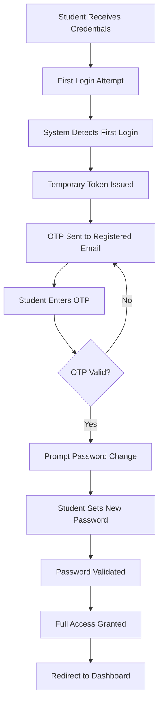

# 🎓 BRICKS Dashboard

<div align="center">

**A Secure Internal Learning Management System**

*Connecting Students, Teachers, and Administrators in the BRICKS Education Ecosystem*

[](https://nodejs.org/)
[](https://www.mongodb.com/)
[](https://bricks.org.in)

[🌐 Live Platform](https://bricks.org.in) • [📖 Documentation](#-api-documentation) • [🐛 Report Issue](https://github.com/AryenMukundam/Bricks/issues) • [✨ Request Feature](https://github.com/AryenMukundam/Bricks/issues/new)

</div>

---

## 📋 Table of Contents

- [Overview](#-overview)
- [Key Features](#-key-features)
- [🧪 Testing Registration (Dev Mode)](#-testing-registration-dev-mode)
- [User Journey](#-user-journey)
- [Security Architecture](#-security-architecture)
- [Tech Stack](#-tech-stack)
- [Installation](#-installation)
- [API Documentation](#-api-documentation)
- [Environment Variables](#-environment-variables)
- [Development & Testing](#-development--testing)
- [Roadmap](#-roadmap)
- [Contributing](#-contributing)

---

## 🎯 Overview

The **BRICKS Dashboard** is a purpose-built, secure internal platform designed exclusively for the BRICKS education ecosystem. It serves as a centralized hub where teachers can create and manage classes, students can access learning materials and attend live sessions, and administrators can oversee the entire educational infrastructure.

🌐 **Live at**: [bricks.org.in](https://bricks.org.in)

Unlike public learning platforms, BRICKS Dashboard operates as a **closed system** — ensuring that only verified institutional members can access the platform, maintaining data integrity and educational quality.


>  **In Production**: User accounts (students, teachers) are created by the BRICKS team during institutional onboarding. Each account is verified, mapped to specific batches/schools, and assigned appropriate roles before credentials are shared.

---

## ✨ Key Features

### **For Students**
- 📚 **Class Discovery** — View upcoming classes with pre-read materials
- 🔔 **Smart Notifications** — Get reminders before class starts
- 🎥 **Live Class Access** — Join sessions directly from the dashboard
- 📊 **Progress Tracking** — Monitor your learning journey and completion rates
- 📝 **Resource Library** — Access all course materials in one place

### **For Teachers**
- ✏️ **Class Creation** — Post and schedule classes with ease
- 📎 **Material Upload** — Attach pre-reads, slides, and resources
- 👥 **Student Management** — View enrolled students per batch
- 📈 **Analytics** — Track attendance and engagement metrics
- 🔗 **Meeting Integration** — Add Zoom/Meet links for live sessions
- 📋 **Assignment Posting** — Add batch-specific assignments

### **For Administrators**
- 👤 **User Management** — Create and manage student/teacher accounts
- 🏫 **Batch Organization** — Configure classes and cohorts
- 📊 **System Analytics** — Monitor platform usage and engagement
- 🔒 **Access Control** — Manage permissions and roles

---

## 🧪 Testing Registration (Dev Mode)

> ⚠️ **Important**: While BRICKS operates as a closed system in production, we've included a **registration endpoint for testing and demonstration purposes**. This allows developers, testers, and stakeholders to explore the full authentication flow.

### 🚀 Quick Start: Test the Platform

Want to try BRICKS Dashboard? Use our test registration endpoint to create a demo account:

#### **Method 1: Using cURL**

```bash
# Create a test student account
curl -X POST https://bricks-dashboard-backend.onrender.com/instructors/register \
  -H "Content-Type: application/json" \
  -d '{
    "name": "Demo Student",
    "email": "demo.student@test.com",
    "password": "TestPassword123!",
    "role": "student",
    "batch": "Demo Batch 2024",
    "school": "Test Academy"
  }'
```


#### **Method 3: Using Postman**

1. Create a new `POST` request
2. URL: `https://bricks-dashboard-backend.onrender.com/instructors/register`
3. Headers: `Content-Type: application/json`
4. Body (raw JSON):

```json
{
  "name": "Your Name",
  "email": "your.email@test.com",
  "password": "YourPassword123!",
  "role": "student",
  "batch": "Test Batch 2024",
  "school": "Demo School"
}
```

### 📝 Registration Request Schema

| Field | Type | Required | Description | Example |
|-------|------|----------|-------------|---------|
| `name` | String | ✅ Yes | Full name of user | "John Doe" |
| `email` | String | ✅ Yes | Valid email address | "john@test.com" |
| `password` | String | ✅ Yes | Strong password (8+ chars) | "SecurePass123!" |
| `role` | String | ✅ Yes | User role: `student` or `teacher` | "student" |
| `batch` | String | ✅ Yes | Batch/class name | "Batch A 2024" |
| `school` | String | ✅ Yes | School/institution name | "BRICKS Academy" |

### ✅ Expected Response

**Success (201 Created):**
```json
{
  "success": true,
  "message": "User registered successfully",
  "user": {
    "id": "60d5ec49f1b2c8b1f8c4e123",
    "name": "Demo Student",
    "email": "demo.student@test.com",
    "role": "student",
    "batch": "Demo Batch 2024",
    "school": "Test Academy"
  },
  "token": "eyJhbGciOiJIUzI1NiIsInR5cCI6IkpXVCJ9..."
}
```

**Error (400 Bad Request):**
```json
{
  "success": false,
  "error": "Email already registered"
}
```

### 🔄 After Registration

Once you've created a test account:

1. **Login** at [bricks.org.in/login](https://bricks.org.in/login)
2. Use the email and password you registered with
3. Complete the **first-time login flow**:
   - Verify OTP sent to your email
   - Set a new secure password
4. Access your personalized dashboard

### ⚠️ Test Account Guidelines

- **Use disposable emails** for testing (e.g., `test@example.com`)
- Test accounts are **periodically cleaned** from the database
- Do **not use real personal information** for test accounts
- This endpoint is **disabled in strict production mode**

---

## 🚀 User Journey

### **First-Time Student Login Flow**

When a student logs in for the first time, BRICKS implements a secure, guided onboarding process:



#### **Step-by-Step Breakdown**

1. **Initial Login**
   - Student uses temporary credentials provided by BRICKS team
   - System identifies this as a first-time login

2. **Identity Verification**
   - A secure OTP is sent to the student's registered email
   - This confirms account ownership and email validity

3. **Password Setup**
   - Student creates a strong, personalized password
   - Old temporary credentials are invalidated

4. **Dashboard Access**
   - After successful setup, student gains full access to classes and materials
   - Subsequent logins use the new password with JWT authentication

#### **Why This Flow?**

- **Security First**: OTP verification prevents unauthorized access
- **User Ownership**: Students control their own passwords from the start
- **Seamless Onboarding**: Simple 3-step process gets students up and running quickly
- **Email Validation**: Confirms communication channel for future notifications

---

### **Teacher Workflow**

Teachers have a straightforward experience focused on content delivery:

1. **Login** → Authenticate with credentials
2. **Dashboard** → View scheduled classes and student batches
3. **Create Class** → Add new session with title, description, date/time
4. **Upload Materials** → Attach pre-reads and resources
5. **Share Link** → Add Zoom/Meet URL for live session
6. **Publish** → Students immediately see the new class
7. **Track** → Monitor attendance and engagement

---

## 🔒 Security Architecture

### **Authentication Flow**

```
┌─────────────┐
│   Client    │
└──────┬──────┘
       │ 1. Login Request (email + password)
       ▼
┌─────────────────────────────────────┐
│         Backend API                 │
│  • Validate credentials             │
│  • Check first login status         │
│  • Generate JWT or Temp Token       │
└──────┬──────────────────────────────┘
       │ 2. Token Response
       ▼
┌─────────────┐
│   Client    │
│  Store JWT  │
└──────┬──────┘
       │ 3. Subsequent Requests
       │    (JWT in Authorization Header)
       ▼
┌─────────────────────────────────────┐
│    Protected Routes                 │
│  • Verify JWT                       │
│  • Check user role                  │
│  • Return authorized data           │
└─────────────────────────────────────┘
```

### **Key Security Features**

- ✅ **JWT-Based Authentication** — Stateless, scalable token system
- ✅ **OTP Email Verification** — Powered by Hostinger SMTP
- ✅ **Role-Based Access Control (RBAC)** — Students, teachers, and admins have distinct permissions
- ✅ **Password Encryption** — bcrypt hashing for all user passwords
- ✅ **Secure Session Management** — Token expiration and refresh mechanisms
- ✅ **API Rate Limiting** — Protection against brute-force attacks
- ✅ **Input Validation** — Sanitized user inputs to prevent injection attacks

---

## 🛠 Tech Stack

### **Backend**
- **Runtime**: Node.js (v18+)
- **Framework**: Express.js
- **Database**: MongoDB with Mongoose ODM
- **Authentication**: JWT (jsonwebtoken)
- **Email Service**: Nodemailer with Hostinger SMTP
- **Password Security**: bcrypt

### **Frontend**
- **Framework**: React.js
- **Styling**: Tailwind CSS / Custom CSS
- **HTTP Client**: Axios
- **Routing**: React Router
- **State Management**: React Context API

### **DevOps & Tools**
- **Version Control**: Git & GitHub
- **Environment Management**: dotenv
- **API Testing**: Postman / Thunder Client
- **Deployment**: [Your hosting service]

---

## 📦 Installation

### **Prerequisites**
- Node.js (v18 or higher)
- MongoDB (local or Atlas cluster)
- Git

### **Setup Steps**

1. **Clone the Repository**
   ```bash
   git clone https://github.com/AryenMukundam/Bricks.git
   cd Bricks
   ```

2. **Install Dependencies**
   ```bash
   # Backend
   cd backend
   npm install

   # Frontend
   cd ../frontend
   npm install
   ```

3. **Configure Environment Variables**
   
   Create a `.env` file in the `backend` directory:
   ```env
   PORT=5000
   MONGO_URI=your_mongodb_connection_string
   JWT_SECRET=your_jwt_secret_key
   EMAIL_HOST=smtp.hostinger.com
   EMAIL_PORT=465
   EMAIL_USER=your_email@domain.com
   EMAIL_PASS=your_email_password
   CLIENT_URL=http://localhost:3000
   NODE_ENV=development
   ```

4. **Start Development Servers**
   ```bash
   # Backend (from backend directory)
   npm run dev

   # Frontend (from frontend directory)
   npm start
   ```

5. **Access the Application**
   - Frontend: `http://localhost:3000`
   - Backend API: `http://localhost:5000`

---

## ⚙️ Environment Variables

### **Required Variables**

| Variable | Description | Example |
|----------|-------------|---------|
| `PORT` | Backend server port | `5000` |
| `MONGO_URI` | MongoDB connection string | `mongodb://localhost:27017/bricks` |
| `JWT_SECRET` | Secret key for JWT signing | `your_super_secret_key_here` |
| `EMAIL_HOST` | SMTP server host | `smtp.hostinger.com` |
| `EMAIL_PORT` | SMTP server port | `465` |
| `EMAIL_USER` | Email account for sending OTPs | `noreply@bricks.org.in` |
| `EMAIL_PASS` | Email account password | `secure_password` |
| `CLIENT_URL` | Frontend URL for CORS | `http://localhost:3000` |
| `NODE_ENV` | Environment mode | `development` or `production` |

---

## 🧪 Development & Testing

### **Running Tests**

```bash
# Backend tests
cd backend
npm test

# Frontend tests
cd frontend
npm test

# Run all tests
npm run test:all
```

### **Test Coverage**

- ✅ Authentication flow (login, OTP, password change)
- ✅ Class creation and management
- ✅ User role permissions
- ✅ API endpoint validation
- ✅ Database operations

### **Manual Testing Checklist**

- [ ] Register a test student account
- [ ] Register a test teacher account
- [ ] Complete first-time login flow
- [ ] Create a class as teacher
- [ ] View class as student
- [ ] Upload materials
- [ ] Test email notifications

---

## 🗺️ Roadmap

### **Phase 1: Core MVP** ✅
- [x] User authentication system
- [x] First-time login flow with OTP
- [x] Basic class creation and viewing
- [x] Student dashboard
- [x] Test registration endpoint

### **Phase 2: Enhanced Features** 🚧
- [ ] Assignment submission system
- [ ] In-app notifications
- [ ] Mobile-responsive design improvements
- [ ] Attendance tracking
- [ ] Real-time class chat

### **Phase 3: Advanced Analytics** 📊
- [ ] Student performance metrics
- [ ] Teacher analytics dashboard
- [ ] Automated reporting
- [ ] Data export capabilities
- [ ] Progress visualization

### **Phase 4: Integrations** 🔗
- [ ] Zoom API integration
- [ ] Calendar sync (Google/Outlook)
- [ ] Payment gateway for courses
- [ ] Certificate generation
- [ ] LMS tool integrations

---

## 🤝 Contributing

BRICKS Dashboard is maintained by the BRICKS development team. We welcome contributions from team members and the community!

### **How to Contribute**

1. **Fork** the repository
2. **Create** a feature branch (`git checkout -b feature/amazing-feature`)
3. **Commit** your changes (`git commit -m 'Add amazing feature'`)
4. **Push** to the branch (`git push origin feature/amazing-feature`)
5. **Open** a Pull Request

### **Code Standards**
- Follow existing code formatting (ESLint/Prettier)
- Write descriptive commit messages
- Add comments for complex logic
- Update documentation for new features
- Write tests for new functionality

### **Reporting Issues**

Found a bug? Have a feature request? Open an issue on [GitHub Issues](https://github.com/AryenMukundam/Bricks/issues) with:
- Clear description of the problem
- Steps to reproduce
- Expected vs actual behavior
- Screenshots (if applicable)

---

## 📄 License

This project is licensed under the MIT License. See the [LICENSE](LICENSE) file for details.

---

## 📞 Contact & Support

**Project Maintainers**: BRICKS Development Team

For questions, issues, or feature requests:
- 📧 **Email**: aryen@bricks.org.in | aryan@bricks.org.in
- 🌐 **Website**: [bricks.org.in](https://bricks.org.in)
- 🐛 **Issues**: [GitHub Issues](https://github.com/AJ5831A/BRICKS_DASHBOARD/issues)
- 📚 **Documentation**: [Wiki](https://github.com/AJ5831A/BRICKS_DASHBOARD/wiki)

---

---

<div align="center">

**Built with ❤️ by the BRICKS Team**

*Empowering Education Through Technology*

[⭐ Star this repo](https://github.com/AryenMukundam/Bricks) • [🍴 Fork it](https://github.com/AryenMukundam/Bricks/fork) • [📢 Share it](https://twitter.com/intent/tweet?text=Check%20out%20BRICKS%20Dashboard%20-%20A%20secure%20learning%20management%20system&url=https://github.com/AryenMukundam/Bricks)

</div>
